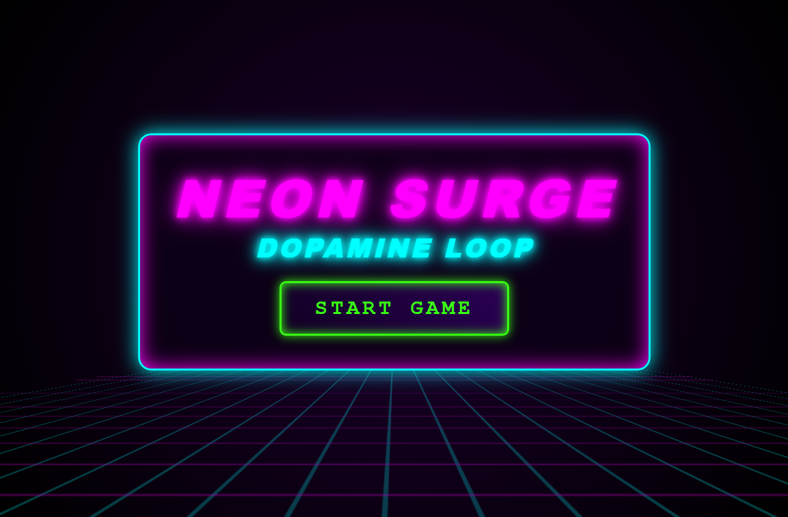
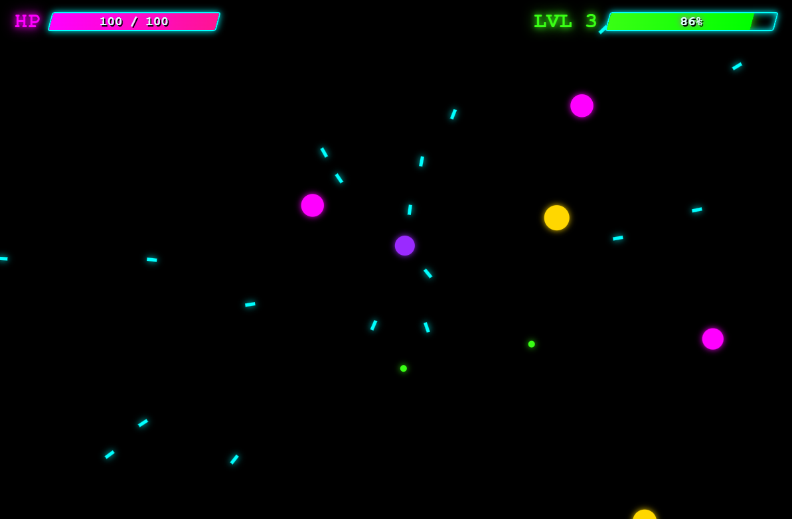
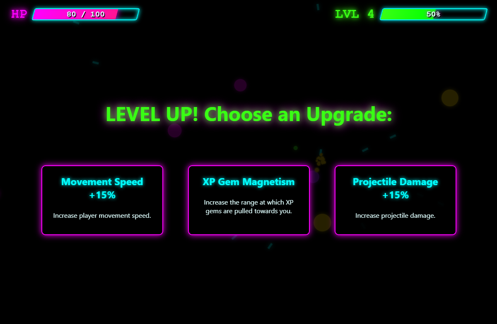
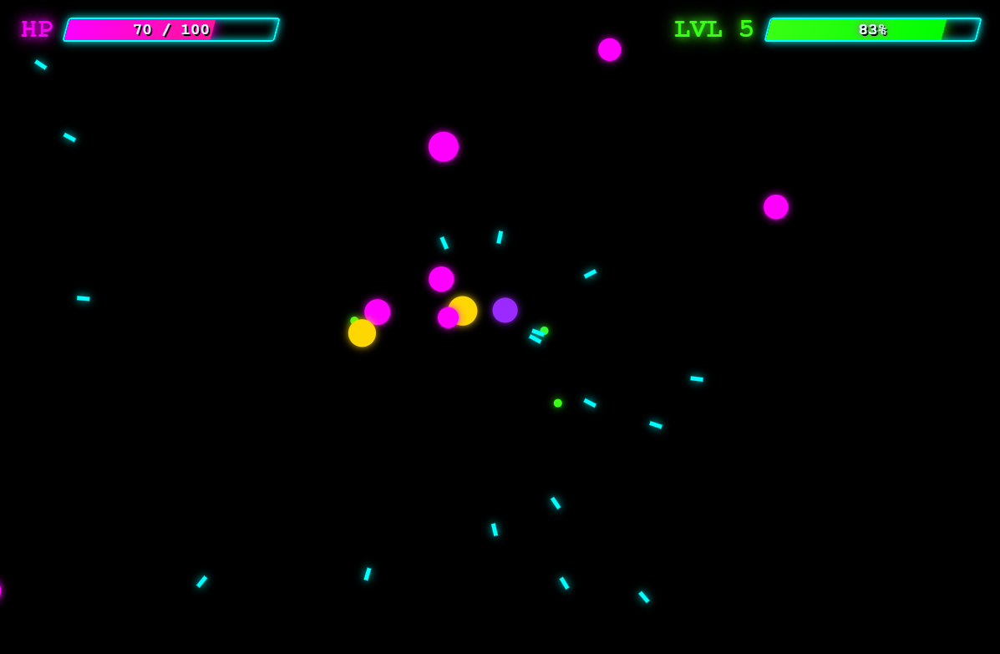
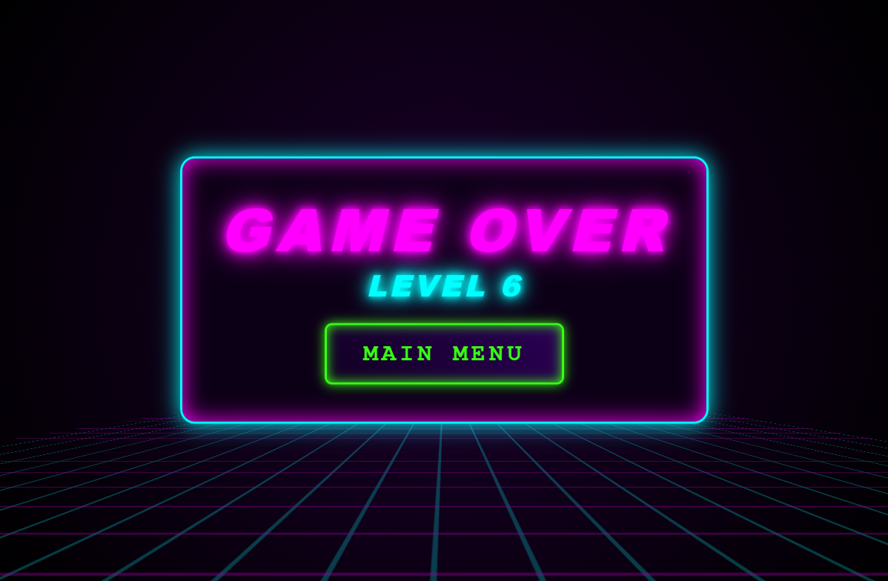

# 🎮 Neon Surge: Dopamine Loop


> A vibrant, fast-paced arcade shooter where you survive relentless waves, collect XP, and level up to unlock devastating abilities.

**[🕹️ Play the Live Demo Here!](https://thegamerbay.github.io/neon-dopamine/)**


## 📸 Gameplay Gallery

<p align="center">
  
  
  
  
  
</p>

## 📖 About the Game

**Neon Surge: Dopamine Loop** is a pure browser-based game built entirely with vanilla JavaScript and the HTML5 Canvas API. No external engines, no dependencies—just raw logic and vibrant neon visuals.

Navigate through endless swarms of enemies, gather XP gems to level up, and choose from a pool of dynamic upgrades. How long can you survive the surge?

📺 **[Watch the Gameplay Trailer/Walkthrough on YouTube](https://youtube.com/)** *(Coming soon)*

## ✨ Features

* **Zero Dependencies:** Built from scratch with pure JS, HTML, and CSS.
* **Fluid Mechanics:** Custom physics, collision detection, and particle systems.
* **Dynamic Leveling:** A roguelite upgrade system that makes every run unique.
* **Vibrant Aesthetics:** Neon visuals with satisfying hit feedback and screen shake.
* **Responsive Design:** Scales dynamically to fit different screen sizes.

## ⌨️ Controls

* **Mouse Movement**: Aim and move your player character.
* **Auto-Fire**: The player fires automatically at the cursor.
* **Spacebar**: Trigger the 'Giant Nova' ability (when unlocked).
* **Left Click**: Select upgrades during the level-up sequence.

## 🛠️ How to Run Locally

Since the game uses local assets, simply opening `index.html` in your browser might cause CORS (Cross-Origin Resource Sharing) errors.

To run the game locally, you need a local web server:

**Option 1: Using VS Code**
1. Install the [Live Server](https://marketplace.visualstudio.com/items?itemName=ritwickdey.LiveServer) extension.
2. Open the project folder in VS Code.
3. Right-click `index.html` and select **"Open with Live Server"**.

**Option 2: Using Python**
1. Open your terminal in the project directory.
2. Run: `python -m http.server 8000`
3. Open your browser and go to `http://localhost:8000`.

**Option 3: Using Node.js**
1. Run `npx serve` in the project root.

## 📂 Project Structure

```text
├── assets/         # Gameplay screenshots
│   ├── gameplay_1.png
│   ├── gameplay_2.png
│   ├── gameplay_3.png
│   ├── gameplay_4.png
│   └── gameplay_5.png
├── src/            # Core JavaScript logic
│   └── main.js     # Main game loop and mechanics
├── index.html      # Main entry point
├── style.css       # UI and canvas styling
└── README.md       # Project documentation
```

## 👨‍💻 Author

**Artem** 
* GitHub: [@artryazanov](https://github.com/artryazanov)

## 📄 License

This project is licensed under the MIT License - see the [LICENSE](LICENSE) file for details.